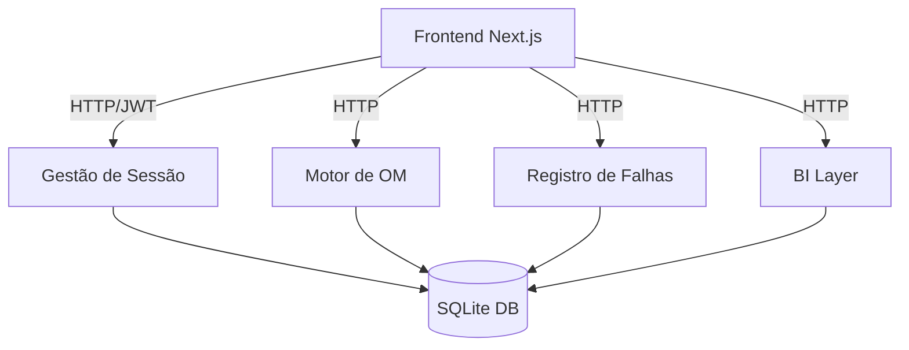

# C4 Component Documentation - System Synthesis

## Overview

Este documento sintetiza a análise de código em componentes lógicos funcionais que compõem o sistema Controle de Falhas AOI.

## Components

### 1. Gestão de Sessão e Segurança

- **Arquivos relacionados**: `authController.js`, `authRoutes.js`, `middleware/auth.js`.
- **Responsabilidades**: Autenticação JWT, controle de permissões (RBAC), criptografia de senhas com bcrypt e limpeza de dados demo no logout.
- **Interfaces**: `/api/auth/login`, `/api/auth/logout`, `/api/auth/me`.

### 2. Motor de Cronometragem de OM (OM Engine)

- **Arquivos relacionados**: `omController.js`, `omRoutes.js`, `ProTimer.tsx`, `ProTimer.tsx`.
- **Responsabilidades**: Gerenciar o estado das OMs (Ativa, Pausada, Finalizada), persistir tempos de parada, calcular tempo líquido decorrido e sincronizar o estado entre backend e frontend.
- **Lógica**: Utiliza uma estrutura em memória no backend para cálculos em tempo real, persistindo snapshots no SQLite.

### 3. Registro e Controle de Falhas

- **Arquivos relacionados**: `registroController.js`, `registroRoutes.js`, `ProForm.tsx`, `ProTable.tsx`.
- **Responsabilidades**: CRUD de falhas, operações em lote (atualização de status, deleção), validação de campos (Serial, P/N, Designador) e geração de requisições para o almoxarifado.

### 4. Dashboard e Analytics (BI Layer)

- **Arquivos relacionados**: `app/qualidade/page.tsx`, `ProMetrics.tsx`, `ProQuality.tsx`.
- **Responsabilidades**: Cálculo de métricas industriais (Yield, DPMO, Sigma), visualização de tendências e análise de Pareto por tipo de defeito.
- **Tecnologia**: Chart.js no frontend; Queries SQL complexas no backend.

### 5. Camada de Persistência

- **Arquivos relacionados**: `config/database.js`, `aoi.db` (SQLite).
- **Responsabilidades**: Execução de queries, transações SQL e manutenção da integridade dos dados.

## Component Relationships Diagram

