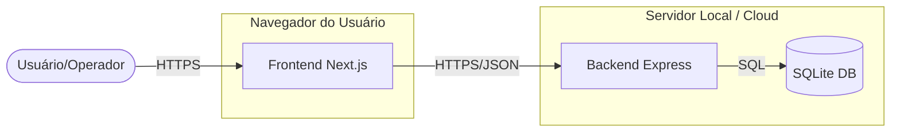

# C4 Container Documentation - Deployment Units

## Overview

Este nível descreve os contêineres de software que compõem o sistema Controle de Falhas AOI e como eles se comunicam.

## Containers

### 1. Web Application (Frontend)

- **Tecnologia**: Next.js 16, React, Tailwind CSS.
- **Descrição**: Interface do usuário acessada via navegador. Responsável pela visualização de dados e interação do usuário.
- **Comunicação**: Faz requisições HTTP RESTful para o Backend.

### 2. API Application (Backend)

- **Tecnologia**: Node.js, Express.
- **Descrição**: Processa a lógica de negócio, autenticação e acesso a dados. Exponde endpoints para o frontend.
- **Comunicação**: Lê e escreve no banco de dados SQLite local.

### 3. Database (Persistência)

- **Tecnologia**: SQLite3.
- **Descrição**: Armazena permanentemente os usuários, registros de falhas, estados de OMs e requisições.
- **Localização**: Arquivo `backend/aoi.db`.

## Container Diagram

## Infrastructure Details

- **Serviço Windows**: O backend pode ser instalado como um serviço Windows usando `nssm` (conforme scripts na pasta `scripts/`).
- **Deploy Cloud**:
  - Frontend: Netlify.
  - Backend: Render.
