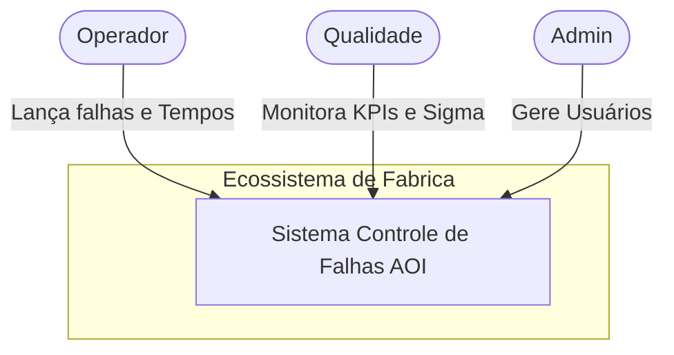

# C4 Context Documentation - System Overview

## Overview

O sistema **Controle de Falhas AOI** é uma ferramenta centralizada para monitoramento e gestão da qualidade em linhas de produção eletrônica.

## Personas

### 1. Operador de Produção

- **Objetivo**: Lançar falhas identificadas nas placas, iniciar e finalizar OMs.
- **Interação**: Utiliza a página de operador para controlar o tempo de produção e reportar defeitos.

### 2. Gestor de Qualidade

- **Objetivo**: Analisar métricas de produção e identificar gargalos ou problemas recorrentes de processo (ex: excesso de solda).
- **Interação**: Utiliza o Dashboard analítico e os relatórios de DPMO/Sigma.

### 3. Administrador do Sistema

- **Objetivo**: Gerir usuários, auditar dados e realizar manutenções no sistema.
- **Interação**: Possui acesso total a todas as funcionalidades, incluindo ferramentas de debug e limpeza de dados.

## System Context Diagram

## Purpose and Value

O sistema agrega valor ao:

- **Reduzir Erros**: Digitalizando o processo de registro que antes poderia ser manual.
- **Acelerar a Análise**: Fornecendo cálculos automatizados de DPMO e Sigma.
- **Melhorar a Rastreabilidade**: Mantendo um log histórico de cada OM e seus defeitos associados.
